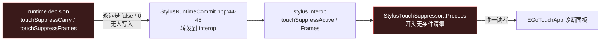
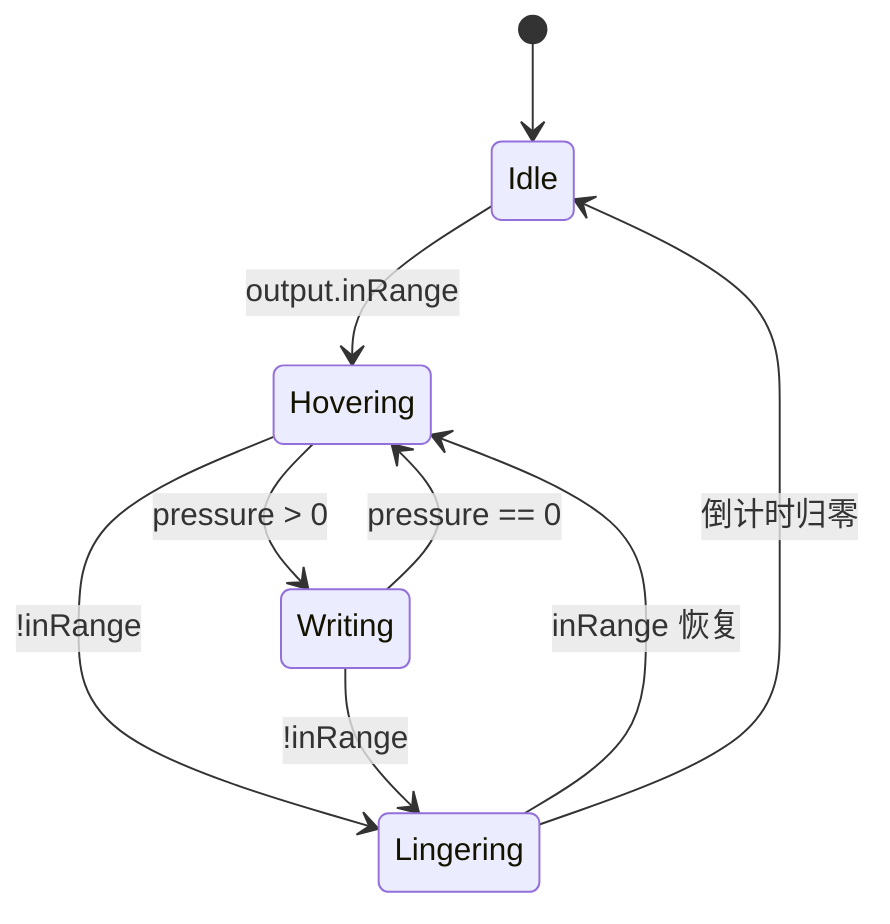
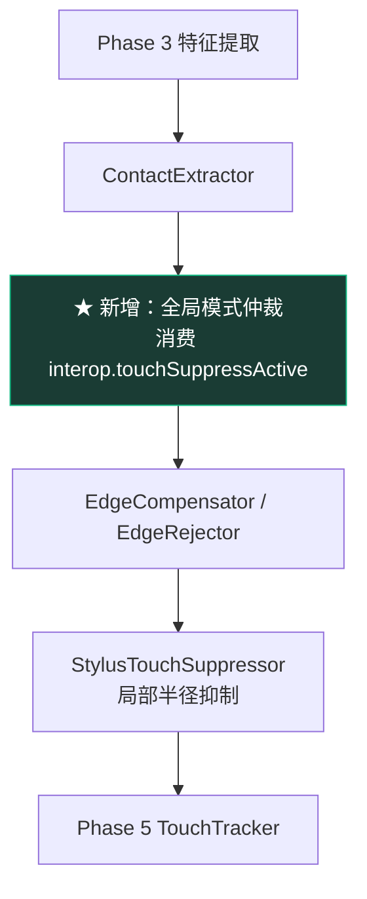

# 笔 / 触摸仲裁层设计

> 状态：**阶段 1-3 已实现，阶段 4（实机调参）待做**
> 起因：掌抑制体验明显弱于原厂 HuaweiTHPService，主要差距在笔与触摸的模式切换上。
>
> 下文第 1、2 节描述的是改动前的状况，保留作为背景。第 4 节记录各阶段的落地内容。

---

## 1. 现状：接线铺好了，中间没接

笔管线已经预留了向触摸侧传递抑制决策的通道，但通道两端都是空的。



三个事实（均已在代码中核实）：

| 事实 | 位置 |
| --- | --- |
| `decision.touchSuppressCarry` / `touchSuppressFrames` 在整个 StylusSolver 里只有定义和转发，**从无写入** | `AsaTypes.hpp:157-158`、`StylusRuntimeCommit.hpp:44-45` |
| 触摸侧在 `Process()` 开头无条件把 interop 的三个抑制字段清零 | `StylusTouchSuppressor.hpp:140-142` |
| `frame.touch.runtime.stylusSuppress` 指针全项目从未赋值，恒为 `nullptr` | `TouchFrameTypes.h:261` |

字段名本身已经描述了缺失的语义：**carry** 是跨帧携带，**frames** 是倒计时 —— 也就是笔抬起后继续抑制一段时间的 lingering 窗口。这正是 Surface 类设备体验的核心，原版的接口形状已经留在代码里了。

## 2. 现有抑制为什么够不着手掌

Release 目前实际生效的只有 `TouchTracker` 的 Stylus AFT，它的第一道门是：

```cpp
if (DistanceSq(touch.x, touch.y, stylusX, stylusY) > aftRadius * aftRadius) return false;
```

`m_stylusAftRadius = 2.8` 格，每格约 4mm，**半径约 11mm**。握笔时掌根接触点距笔尖 30~80mm，完全在门外。

所以现有机制的定位是「笔尖附近的伪影抑制」，不是掌抑制。要拿到原厂那种体验，缺的不是把半径调大 —— 那会误伤笔尖附近的真实手指 —— 而是一个**全局模式仲裁**：笔进入感应范围时整块屏幕切换策略。

## 3. 设计

### 3.1 状态机

放在笔管线侧，输出写入 `runtime.decision`，让既有的转发链路自然生效。



| 状态 | `touchSuppressCarry` | `touchSuppressFrames` | 含义 |
| --- | --- | --- | --- |
| `Idle` | false | 0 | 无笔，触摸完全放行 |
| `Hovering` | true | 持续刷新 | 笔悬停，中等强度抑制 |
| `Writing` | true | 持续刷新 | 笔接触，最强抑制 |
| `Lingering` | true | 逐帧递减 | 笔已离开，防抬笔瞬间掌反弹 |

`Lingering` 是关键：抬笔时手掌往往还压在屏上，且此刻笔尖信号已消失，任何基于笔尖距离的判断都会立刻失效。倒计时建议从 **40 帧**起调（120Hz 下约 330ms）。

### 3.2 触摸侧消费

把 `StylusTouchSuppressor::Process()` 开头的无条件清零改为读取。仲裁分两层，各司其职：

| 层 | 依据 | 作用范围 | 处理对象 |
| --- | --- | --- | --- |
| 全局模式（新增） | `interop.touchSuppressActive` | 整屏 | 大面积接触（掌）直接拒绝 |
| 局部半径（现有） | 笔尖距离 ≤ 2.8 格 | 笔尖邻域 | 笔尖伪影、弱触摸 |

全局层的判据用面积/信号而非距离，正好接管 AFT 里那套 `m_stylusAftPalm*` 参数 —— 它们此前因为判断顺序问题基本不可达，现在已修正顺序（`TouchTracker.hpp`），在新框架下可以直接复用。

### 3.3 必须保留的例外

一刀切会毁掉正常使用，以下情况**不**抑制：

- **笔来之前就已在跟踪的手指轨道**。否则笔一悬停就打断进行中的双指滚动/缩放。只对笔模式期间**新建**的接触收紧准入。
- **明确的手指特征接触**：面积小、信号锐利、远离掌区。用户用笔时另一只手点按钮是常见操作。

### 3.4 集成点



放在 `ContactExtractor` 之后、`TouchTracker` 之前。在轨道建立**前**拒绝，避免 tracker 里出现一闪即逝的鬼影轨道 —— 那会污染 GapRelink 和 ID 分配。

## 4. 分阶段实施

| 阶段 | 内容 | 可验证方式 | 状态 |
| --- | --- | --- | --- |
| 1 | 笔侧写入 `decision.touchSuppressCarry` / `touchSuppressFrames`，状态机落地 | 单测：给定 inRange/pressure 序列，断言状态与倒计时 | **已完成** |
| 2 | 触摸侧改清零为消费，接上全局层 | 单测：模拟掌接触 + 笔活跃，断言被拒 | **已完成** |
| 3 | 例外规则（已有轨道、手指特征） | 单测：滚动中笔悬停，断言轨道存活 | **已完成** |
| 4 | 实机调参：lingering 窗口、面积阈值 | Debug 构建 + EGoTouchApp 实时调 | 待实机 |

阶段 1~3 全部可用单测覆盖，不需要设备。阶段 4 必须实机，且必须先完成 config 解耦（见下）。

### 阶段 1 已落地的内容

- `shared/StylusTouchArbiter.hpp` — 状态机，作为 `StylusPipeline` 成员
- 接在 `Process()` 与 `FinalizeTerminalFrame()` 两条路径的 `Commit()` 之前。终止帧路径不可省略：那正是笔消失、倒计时需要继续递减的时刻。它也**刻意不**挂进 `ResetStatefulStages()`，否则 lingering 会被立即清零
- 配置键 `stylus.sp.touch_arbiter_enabled` / `touch_arbiter_linger_frames`，三处默认值一致
- `SolversUnit_StylusTouchArbiter` — 6 个用例，覆盖各状态转移、倒计时递减、笔返回重置窗口、禁用惰性、零窗口

### 阶段 2/3 已落地的内容

- `StylusTouchSuppressor::Process` 不再清零 `interop.touchSuppress*`，而是先捕获 arbiter 的结论，再与自己的局部结论合并写回。信号因此能穿过触摸阶段传到 tracker
- `TouchTracker::ShouldPenModeSuppress` — 全局判定，**不设半径门**（掌远在 `m_stylusAftRadius` 之外，且 lingering 期间根本没有笔尖坐标）
- 轨道年龄 vs `m_penModeFramesElapsed`（笔模式已持续帧数）区分"笔来之前就有的手势"与"笔模式期间新建的接触"，前者豁免
- 接在两条路径上：已匹配轨道的更新、以及新轨道创建
- 配置键 `touch.stylus_suppress.pen_mode_enabled`
- `SolversUnit_TouchPenModeSuppress` — 6 个用例，含 lingering 期间保持抑制、进行中手势不被劫持、手指不被误伤

> [!IMPORTANT]
> 全局判定**只用 `area`，不用 `sizeMm`**。`sizeMm` 不是实测值，而是由 `EstimateSizeMm` 从 signalSum 拟合的 `cbrt(signalSum) * 0.35`；反解可知 2.5 mm 阈值只需 `signalSum >= 364`，几乎任何真实接触都满足，包括指尖。局部 AFT 路径沿用 `area || sizeMm` 是既有行为，且有 11 mm 半径门兜底，影响面小；全局路径没有半径门，若沿用同一判据会在笔进入感应范围时抑制掉所有触摸输入。

## 5. 前置依赖

**已解除**。`ApplyConfigStore()` / `InitializeConfigStores()` / `ValidateStartupConfig()` 原先被 `#if EGOTOUCH_SERVICE_ENABLE_IPC` 包着，Release 下 `applyConfig()` 从不执行、参数只能取成员初始化值。`ConfigRuntime` 本身不依赖 IPC（只 include Common 的 Config 头），那个 `#if` 圈错了范围，现已移出。

两种构建现在走同一条配置注入路径，阶段 4 在 Debug 里调出的参数可以直接固化为默认值并对 Release 生效。`SolversUnit_PipelineDefaultsConsistency` 继续守护三处默认值一致。

## 6. 参数预算

初始取值，全部需实机标定：

| 参数 | 建议初值 | 说明 |
| --- | --- | --- |
| lingering 帧数 | 40 | 约 330ms @120Hz |
| hover 抑制面积阈值 | 20 | 复用 `m_stylusAftPalmAreaThreshold` |
| writing 抑制面积阈值 | 14 | 落笔时更激进 |
| 手指豁免最大面积 | 12 | 与 `IsStrongTouchCandidate` 对齐 |
| 已有轨道保护 | 无条件 | 不设阈值 |
